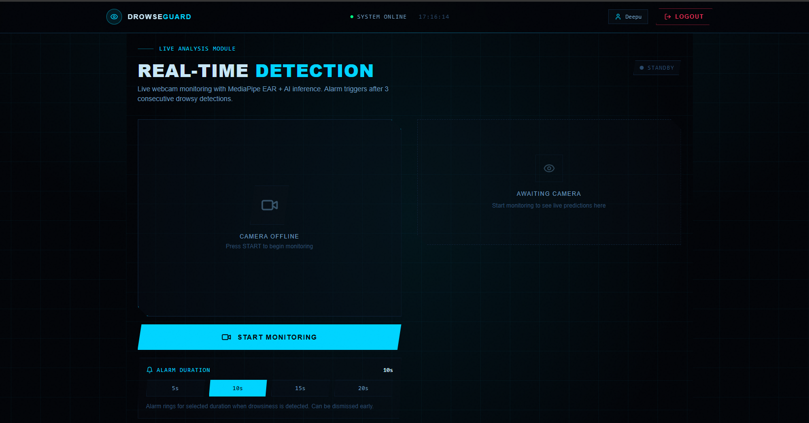

# Driver Drowsiness Detection System (DDDS)

A full-stack AI-powered system that detects driver drowsiness 
in real time using webcam feeds and static image uploads.

## Tech Stack
- **Frontend:** React + Vite, TailwindCSS
- **Backend:** Node.js, Express.js
- **AI/ML:** Python, Flask, TensorFlow/Keras, MediaPipe
- **Database:** MongoDB Atlas
- **Auth:** JWT

## Features
- User Authentication (Register / Login)
- Image Upload Detection — upload a driver photo for analysis
- Live Webcam Detection — real-time frame-by-frame analysis
- MediaPipe EAR (Eye Aspect Ratio) for eye closure detection
- Alarm system with user-selectable duration (5s / 10s / 15s / 20s)
- Consecutive drowsy frame detection before triggering alarm
- DROWSY state held in UI for 10 seconds after detection
- MongoDB prediction history storage
- JWT protected routes

## Model
- Architecture: MobileNetV2 (Transfer Learning)
- Dataset: NTHU Driver Drowsiness Detection Dataset
- Classes: `notdrowsy`, `sleepy`, `slowBlink`, `yawning`
- Two-phase training: frozen base → fine-tuned top 30 layers

## Setup

### Backend (Node.js)
cd backend
npm install
node server.js

### Python/Flask
cd backend
pip install -r requirements.txt
python app.py

### Frontend
cd frontend
npm install
npm run dev

## Environment Variables (.env)
MONGO_URI=your_mongodb_uri
JWT_SECRET=your_jwt_secret

# Screenshots

## Home Page

## Login Page

## Register Page

## Detection Page

## Prediction Result

### Live Webcam Detection

